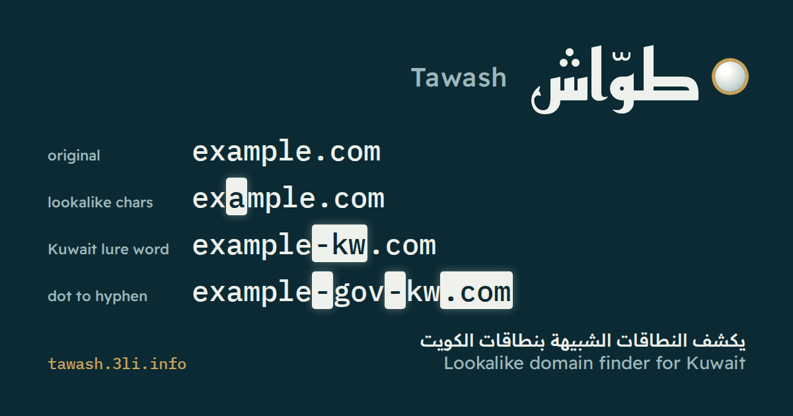

<p align="center"></p>

<div dir="rtl">

# طوّاش (Tawash)

يكشف طوّاش النطاقات الشبيهة التي صُنعت لتبدو كأنها نطاقات الكويت الأصلية، إذ يكفي أن تعطيه نطاقاً فيولّد أخطاء الكتابة والحروف المبدّلة والحروف الأجنبية والكتابات اللاتينية للأسماء العربية التي قد يسجّلها المحتال، ثم يسأل نظام أسماء النطاقات عن الموجود منها اليوم، كما يقرأ القائمة اليومية للنطاقات المسجلة حديثاً وسجلات شفافية الشهادات بحثاً عن أسماء تستعير علامة رسمية كويتية.

[Read in English](README.md)

جرّبه في المتصفح على **https://tawash.3li.info/** أو من سطر الأوامر:

</div>

```sh
npx github:SiteQ8/Tawash scan example.com
```

<div dir="rtl">

يحتاج طوّاش إلى `Node.js` بالإصدار 20 أو أحدث فقط، إذ لا توجد أي حزم إضافية لتثبيتها.

## سبب التسمية

كان الطوّاش في زمن الغوص على اللؤلؤ في الكويت تاجراً يبحر إلى سفن الغوص ويفحص كل لؤلؤة قبل أن يدفع ثمنها، وعلى نهجه يفحص طوّاش النطاقات بحثاً عن تلك التي صُنعت لتبدو أصلية.

## ماذا يفعل

يجمع طوّاش بين نهجين معروفين ويضبطهما على الكويت.

يولّد النهج الأول النطاقات الشبيهة بنطاق واحد ثم يفحصها كما تفعل أداة البحث عن النطاقات المنتحلة بالأخطاء المطبعية التي أعدّها مركز CIRCL، إذ ينفّذ طوّاش كل الأساليب الموثقة لدى CIRCL ويضيف إليها ثلاثة أساليب تهم الكويت، وهي الكتابات اللاتينية للأسماء العربية مثل `souq` و`souk` و`suq`، وكلمات الاستدراج التي يلصقها المحتالون في الكويت بالعلامة مثل `kw` و`q8` و`knet` و`pay` و`login`، ونهايات الخليج التي يُنقل إليها الاسم مثل `com.kw` و`gov.kw` و`sa` و`ae`.

ويستخلص طوّاش خوادم الأسماء والبريد الخاصة بالنطاق الأصلي من تلقاء نفسه، لذا تُعلَّم النطاقات الشبيهة التي تملكها العلامة أصلاً على أنها تابعة لك بدل أن تثير الإنذار، كما يقرأ تاريخ تسجيل كل نطاق شبيه من خدمة RDAP لأن الاسم المسجل الأسبوع الماضي أهم من اسم مسجل عام 1996.

أما النهج الثاني فيراقب ما يُسجَّل كما تفعل أداة openSquat، إذ تنشر WhoisDS كل يوم نحو سبعين ألف نطاق مسجل حديثاً، وتصل كل شهادة TLS عامة إلى سجلات شفافية الشهادات، فيطابق طوّاش المصدرين مع قائمة مراقبة يمكن أن تضم كل الجهات الرسمية في [سجل أصلي](https://asli.3li.info/) بخيار واحد.

ويعمل المحرك نفسه في المتصفح وفي سطر الأوامر، فلا تحتاج أداة البحث على الويب إلى أي خادم لأن متصفحك هو من يستعلم في نظام أسماء النطاقات.

## الأوامر

### `scan <domain>`

يولّد النطاقات الشبيهة بنطاق ويفحص كلاً منها في نظام أسماء النطاقات ويقرأ تواريخ التسجيل، ثم يمنح الموجود منها درجة ويعرض ما يستحق النظر.

</div>

```sh
npx github:SiteQ8/Tawash scan example.com
npx github:SiteQ8/Tawash scan example.gov.kw --web --certs --format csv --out report.csv
npx github:SiteQ8/Tawash scan example.com.kw --lang ar
```

<div dir="rtl">

يجلب الخيار `--web` صفحة كل نطاق شبيه نشط ويقارن عنوانها بعنوان صفحة الأصل ويبحث فيها عن اسم الجهة، علماً أن الأسماء تأتي من سجل أصلي ومن الخيار `--claim`، بينما يسأل الخيار `--certs` خدمة Cert Spotter عن الشهادات الصادرة خلال الثلاثين يوماً الأخيرة، ولأن الخيارين يتصلان بالنطاقات الشبيهة أو بجهات أخرى فلا يعملان إلا عند طلبهما.

### `permute <domain>`

يسرد النطاقات الشبيهة دون فحص أي شيء، وهذا مفيد لتمريرها إلى أداة أخرى.

</div>

```sh
npx github:SiteQ8/Tawash permute example.com --format json
```

<div dir="rtl">

### `nrd`

ينزّل قائمة الأمس للنطاقات المسجلة حديثاً من WhoisDS ويطابقها مع قائمة المراقبة، ويمكن إضافة الخيار `--dns` لفحص المطابقات.

</div>

```sh
npx github:SiteQ8/Tawash nrd --asli --dns
npx github:SiteQ8/Tawash nrd --keywords examples/keywords.txt --date 2026-09-24
npx github:SiteQ8/Tawash nrd --keyword examplebank --feed domain-names.zip
```

<div dir="rtl">

### `ct <keyword>`

يبحث في سجلات شفافية الشهادات عبر `crt.sh` عن أسماء تحمل علامة ما، ويُبحث عن العلامات المؤلفة من ثلاثة أحرف أو أقل مقرونة بالكويت لأنها وحدها تطابق نصف الإنترنت، ولأن `crt.sh` كثيراً ما يكون مثقلاً فإن كل استعلام يُعاد عند فشله، فإذا ظل المصدر متوقفاً قال طوّاش ذلك صراحة وأنهى التشغيل بالرمز 4 بدل أن يعلن نتيجة نظيفة.

</div>

```sh
npx github:SiteQ8/Tawash ct examplebank --days 7 --dns
```

<div dir="rtl">

### `watch`

هو التشغيل اليومي، إذ يشغّل `nrd` ثم `ct` مع الخيار `--ct` ثم النطاقات الشبيهة بكل نطاق رسمي مع الخيار `--permutations`، ويفحص الجميع في نظام أسماء النطاقات ويكتب النتائج في مجلد بصيغتي JSON وMarkdown.

وتُكتب الأسماء التي تبلغ الحد المحدد بالخيار `--alert-at` ولم يُنبَّه إليها من قبل في الملف `alert.md`، لذا تستطيع مهمة مجدولة أن تفتح بلاغاً فقط عند ظهور شيء جديد، كما يحتفظ المجلد بما نُبّه إليه على هيئة بصمات مشفّرة فلا يكشف ملف الحالة اسم أحد.

</div>

```sh
npx github:SiteQ8/Tawash watch --asli --ct --out reports
```

<div dir="rtl">

### `algorithms`

يسرد الأساليب مع سطر يشرح كلاً منها.

## قائمة المراقبة

تحتاج الأوامر `nrd` و`ct` و`watch` إلى معرفة ما تبحث عنه.

| الخيار | ما يضيفه |
|---|---|
| `--asli` | كل الجهات الرسمية في سجل أصلي بما فيها أسماء العلامات والنطاقات الرسمية والأسماء التي تُعرف بها كل جهة |
| `--keywords <file>` | اسم علامة أو نطاق واحد في كل سطر، ويبدأ التعليق بالعلامة `#` |
| `--keyword <word>` | اسم علامة واحد ويمكن تكراره |

لا يُبلَّغ عن النطاقات الرسمية أبداً، بل تصبح أسماؤها كلمات بحث أيضاً، أما الأسماء التي تُعد كلمات شائعة في مكان ما مثل `customs` و`manpower` و`citra` فلا تُحتسب إلا إذا أشار النطاق إلى الكويت كذلك.

## الخيارات

| الخيار | معناه |
|---|---|
| `--format <f>` | `table` أو `json` أو `csv` أو `misp` أو `stix` أو `md` |
| `--out <path>` | يكتب النتيجة في ملف أو في مجلد مع الأمر `watch` |
| `--lang <en\|ar>` | لغة الحالات والأسباب |
| `--algorithms <list>` | أساليب مفصولة بفواصل للأمرين `scan` و`permute` |
| `--all` | يعرض كل النطاقات الشبيهة لا الموجودة منها فقط |
| `--doh <google\|cloudflare>` | يستعلم عبر DNS فوق HTTPS بدل خادم الأسماء في النظام |
| `--resolver <ip,ip>` | يستخدم خوادم DNS هذه |
| `--concurrency <n>` | عدد الاستعلامات المتوازية وهو 32 افتراضياً و8 مع `--doh` |
| `--known-ns <list>` | خوادم الأسماء التابعة لك |
| `--known-mx <list>` | خوادم البريد التابعة لك |
| `--exclude <file>` | نطاقات تُستبعد بواقع نطاق في كل سطر |
| `--web` | يجلب صفحات النطاقات النشطة ويقارنها بصفحة الأصل |
| `--certs` | يبحث عن الشهادات الحديثة للنطاقات النشطة |
| `--claim <text>` | اسم تُعرف به الجهة يُبحث عنه في صفحات النطاقات الشبيهة ويمكن تكراره |
| `--no-age` | يتخطى تواريخ التسجيل من خدمة RDAP |
| `--permutations` | يفحص الأمر `watch` أيضاً النطاقات الشبيهة بكل نطاق رسمي |
| `--date <yyyy-mm-dd>` | يوم قائمة النطاقات المسجلة حديثاً وهو أمس افتراضياً |
| `--feed <file>` | يقرأ النطاقات المسجلة حديثاً من ملف نصي أو مضغوط |
| `--confidence <0-4>` | المستوى 0 هو الأشد و4 يجد أكثر، والافتراضي 1 |
| `--dns` | يفحص مطابقات `nrd` و`ct` في نظام أسماء النطاقات |
| `--ct` | يضيف سجلات الشهادات إلى الأمر `watch` |
| `--days <n>` | المدة التي تعود إليها سجلات الشهادات بالأيام وهي 3 افتراضياً |
| `--alert-at <score>` | يكتب الأمر `watch` الملف `alert.md` عندما تبلغ درجة هذا الحد وهو 50 افتراضياً |
| `--fail-on <score>` | ينهي التشغيل بالرمز 3 عندما تبلغ درجة هذا الحد |
| `--version` | يطبع رقم الإصدار |
| `--help` | يطبع المساعدة، وتظهر بالعربية مع `--lang ar` |

رموز الإنهاء هي 0 عند انتهاء التشغيل، و1 عند الخطأ، و2 عند الاستخدام الخاطئ، و3 عند بلوغ درجة الحد المحدد بالخيار `--fail-on`، و4 عند تعذّر الوصول إلى مصدر البيانات.

## الأساليب

| الأسلوب | ما يفعله | مثال |
|---|---|---|
| `homoglyph` | حروف متشابهة الشكل بما فيها الحروف الكيريلية واليونانية | من `example.com` إلى `examp1e.com` أو `exаmple.com` |
| `transliteration` | كتابات لاتينية أخرى للاسم العربي | من `souq.example` إلى `souk.example` أو `suq.example` |
| `kuwait-affix` | الاسم ملصوقاً بكلمات استدراج يستعملها المحتالون في الكويت | من `example.com` إلى `example-kw.com` أو `knetexample.com` |
| `omission` | حذف حرف واحد | من `example.com` إلى `exmple.com` |
| `repetition` | كتابة أحد الحروف مرتين | من `example.com` إلى `exxample.com` |
| `transposition` | تبديل موضعي حرفين متجاورين | من `example.com` إلى `exmaple.com` |
| `replacement` | استبدال حرف بمفتاح يجاوره على لوحات `QWERTY` و`QWERTZ` و`AZERTY` | من `example.com` إلى `exanple.com` |
| `double-replacement` | استبدال الحرفين المتكررين معاً بمفتاح مجاور | من `summer.example` إلى `sunner.example` |
| `vowel-swap` | استبدال حرف علة بآخر مع إبقاء الحرف الأول كما هو | من `example.com` إلى `exomple.com` |
| `addition` | إضافة حرف أو رقم واحد | من `example.com` إلى `example1.com` |
| `add-dash` | إضافة واصلة داخل الاسم | من `example.com` إلى `exam-ple.com` |
| `strip-dash` | حذف الواصلة | من `my-example.com` إلى `myexample.com` |
| `plural` | تحويل الاسم إلى صيغة الجمع أو المفرد | من `example.com` إلى `examples.com` |
| `misspelling` | أخطاء إملائية شائعة في الكلمات الإنجليزية داخل الاسم بما فيها كلمة الكويت | من `kuwait-example.com` إلى `kuwiat-example.com` |
| `homophones` | كلمات متشابهة النطق | من `buy-example.com` إلى `bye-example.com` |
| `numeral-swap` | كتابة الأرقام بالحروف والكلمات بالأرقام | من `example-one.com` إلى `example-1.com` |
| `subdomain` | إدخال نقطة داخل الاسم فيتحول جزء من العلامة إلى نطاق فرعي | من `example.com` إلى `exam.ple.com` |
| `missing-dot` | حذف إحدى النقاط | من `example.com` إلى `wwwexample.com` |
| `dot-to-dash` | تحويل النقطة إلى واصلة | من `example.gov.kw` إلى `example-gov-kw.com` |
| `wrong-sld` | نهاية أخرى من المستوى الثاني | من `example.gov.kw` إلى `example.com.kw` |
| `wrong-tld` | نهاية أخرى من المستوى الأعلى بما فيها نطاقات الخليج | من `example.com` إلى `example.com.kw` أو `example.xyz` |
| `add-tld` | إضافة رمز دولة بعد النطاق كاملاً | من `example.com` إلى `example.com.ae` |
| `dynamic-dns` | الاسم تحت خدمات DNS الديناميكية المجانية | من `example.com` إلى `example.duckdns.org` |
| `bitsquatting` | قلب بت واحد وهو الخطأ الذي تُحدثه شريحة ذاكرة معطوبة | من `example.com` إلى `exampde.com` |

## الحالات والدرجة

| الحالة | معناها |
|---|---|
| نشط | له عنوان إنترنت، أي أنه قادر على تشغيل موقع |
| مسجّل | موجود في نظام أسماء النطاقات بلا عنوان إنترنت حتى الآن أو أن خوادم أسمائه لا تجيب |
| تابع لك | يشترك مع الأصل في خوادم الأسماء أو البريد، لذا يُرجّح أن مالكه هو المالك نفسه |
| غير موجود | لم يسجّله أحد بعد |
| غير معروف | تعذّر الاستعلام عنه مرتين |

تجمع الدرجة الأدلة ويأتي كل جزء منها مع سبب يمكنك التحقق منه، فهي تخبرك من أين تبدأ ولا تحكم بأن الموقع احتيالي، ولأن معظم الأسماء القصيرة سُجّلت قبل عقود على يد أشخاص لا شأن لهم بالكويت وتستجيب كلها تقريباً على الويب وتستقبل البريد فإن هذه الحقائق تنال القليل، بينما تنال النية والحداثة أكثر النقاط.

| الدليل | النقاط |
|---|---|
| موجود في نظام أسماء النطاقات | 10 |
| له عنوان إنترنت | 10 |
| يستقبل البريد الإلكتروني | 10 |
| كلمات استدراج في الاسم | 25 |
| يشير اسمه إلى الكويت | 20 |
| حروف من أبجديات أخرى | 25 |
| نهاية رخيصة شائعة في الاحتيال | 10 |
| استضافة مجانية | 15 |
| يختلف عن الأصل بحرف واحد | 5 |
| سُجّل خلال الأيام الثلاثين الأخيرة | 30 |
| سُجّل خلال السنة الأخيرة | 15 |
| ورد في القائمة اليومية للنطاقات المسجلة حديثاً | 30 |
| ظهر في سجلات شفافية الشهادات | 15 |
| عنوان صفحته يشبه عنوان صفحة الأصل | 25 |
| صفحته تذكر اسم الجهة | 30 |
| لديه شهادة TLS حديثة | 15 |

تُعد الدرجة 70 فأكثر عالية و40 فأكثر متوسطة، أما النطاق الموقوف لدى خدمة لركن النطاقات فيحتفظ ببقية أدلته لكنه لا ينال شيئاً على عناوين خدمة الركن.

## متى يُعد النطاق تابعاً لك

لا يُعلَّم النطاق الشبيه على أنه تابع لك إلا بدليل يصعب تزويره، أي أن تكون خوادم أسمائه داخل النطاق الأصلي مثل `ns1.example.com`، أو أن تطابق خوادم أسمائه خوادم الأصل تماماً على ألا تكون خوادم مشتركة لدى مسجّل نطاقات، أو أن يستخدم أحد خوادم بريد الأصل على أن يكون خاصاً بالمستأجر، أو أن يستخدم خادماً أدرجته بالخيار `--known-ns` أو `--known-mx`، أما الاشتراك في خوادم أسماء GoDaddy أو خوادم بريد Google فلا يثبت شيئاً ولذلك لا يُحتسب.

## صيغ المخرجات

| الصيغة | لمن |
|---|---|
| `table` | للقارئ في سطر الأوامر |
| `json` | للبرامج ويضم التقرير كاملاً |
| `csv` | لجداول البيانات مع علامة ترتيب البايت لبرنامج Excel وتعطيل الصيغ لأن عناوين الصفحات تأتي من غرباء |
| `misp` | حدث MISP تكون فيه قيمة `to_ids` هي `false` مع الوسمين `tlp:amber` و`workflow:state="incomplete"` |
| `stix` | حزمة `STIX 2.1` من مشاهدات النطاقات والعناوين بمعرّفات ثابتة ولا تضم مؤشرات أبداً |
| `md` | تقرير Markdown لبلاغ أو رسالة بريد |

## مراقبة يومية في مستودع خاص

يشغّل الملف [`examples/watch-workflow.yml`](examples/watch-workflow.yml) الأمر `watch` كل صباح عبر GitHub Actions ويفتح بلاغاً عند ظهور الملف `alert.md`، لذا ضعه في مستودع **خاص** لأن الاسم الذي يستعير علامة ما ليس احتيالاً بالضرورة، ونشر اتهام لم يُراجَع ظلم لمالكه، ولهذا تبقى النطاقات المرشحة حيث يراجعها شخص أولاً، كما ينبغي تثبيت وسم الإصدار كما في المثال حتى تشغّل المهمة شيفرة قرأتها.

## الخصوصية والاستخدام المسؤول

ترسل أداة البحث على الويب اسم كل نطاق شبيه من متصفحك إلى خدمة Google Public DNS، أو إلى Cloudflare إن لم تُجب Google، وتسأل سجلات RDAP عن تواريخ التسجيل، ولا يصل أي شيء إلى طوّاش، كما تظهر النطاقات الشبيهة نصاً لا روابط، بينما يستخدم سطر الأوامر خادم الأسماء الخاص بك ما لم تمرر الخيار `--doh`.

صُمّم طوّاش لحماية العلامات وعملائها، وفحص وجود الأسماء عمل عام في نظام أسماء النطاقات، لكن الخيار `--web` يتصل بالمواقع نفسها وقد يكون بعضها لمحتالين، لذا شغّله من شبكة يُقبل فيها ذلك، وللإبلاغ عن مشكلة راجع [`SECURITY.md`](SECURITY.md).

## مصادر الفكرة والبيانات

يقوم طوّاش على أفكار أداة [openSquat](https://github.com/atenreiro/opensquat) التي أعدّها Andre Tenreiro وأداة [البحث عن النطاقات المنتحلة](https://typosquatting-finder.circl.lu/) التي أعدّها مركز CIRCL، ويتبع فهرس الأساليب توثيق CIRCL، ولم تُنسخ أي شيفرة من الأداتين.

وتأتي البيانات من [WhoisDS](https://www.whoisds.com/newly-registered-domains) للنطاقات المسجلة حديثاً، ومن [`crt.sh`](https://crt.sh/) و[Cert Spotter](https://sslmate.com/certspotter/) للشهادات، ومن [ملف RDAP التمهيدي](https://data.iana.org/rdap/dns.json) لدى IANA والسجلات المدرجة فيه لتواريخ التسجيل، ومن [Google Public DNS](https://developers.google.com/speed/public-dns/docs/doh/json) و[Cloudflare](https://developers.cloudflare.com/1.1.1.1/encryption/dns-over-https/make-api-requests/dns-json/) للاستعلام عبر DNS فوق HTTPS، ومن [سجل أصلي](https://asli.3li.info/) للقنوات الرسمية في الكويت.

## التطوير

</div>

```sh
node --test                        # كل الاختبارات دون حاجة إلى الشبكة
node scripts/sync-web.mjs          # ينسخ src/engine إلى docs/js/engine بعد تعديل المحرك
node scripts/sync-web.mjs --check  # ما تشغّله مهمة التكامل المستمر
```

<div dir="rtl">

يعمل المجلد `src/engine` دون تعديل في `Node.js` وفي المتصفح، والمجلد `docs/js/engine` نسخة مطابقة له بايتاً ببايت تحرسها الاختبارات، بينما يضم المجلد `src/node` ما لا يقدر عليه إلا `Node.js` مثل خادم الأسماء في النظام والملفات المضغوطة والقائمة اليومية وسجلات الشهادات وفحص الصفحات، وتعيش كل النصوص في الملف `src/engine/strings.js` بالإنجليزية والعربية، فتفشل الاختبارات إذا نقص نص في إحدى اللغتين أو اختلفت المواضع المتغيرة أو خالف النص العربي قواعد ترقيمه.

## الترخيص

ترخيص MIT، والتفاصيل في الملف [`LICENSE`](LICENSE).

</div>
